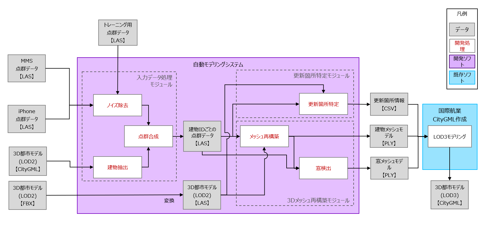
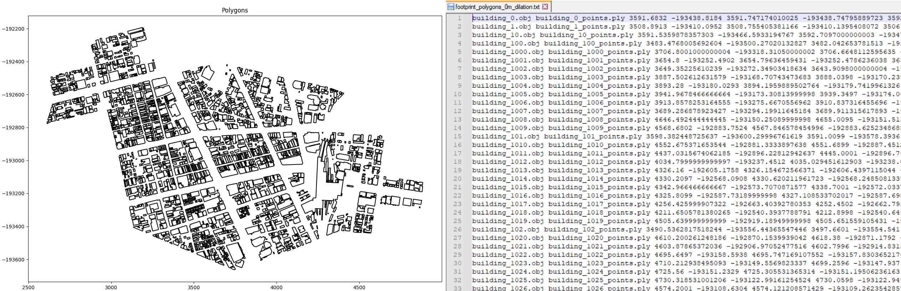
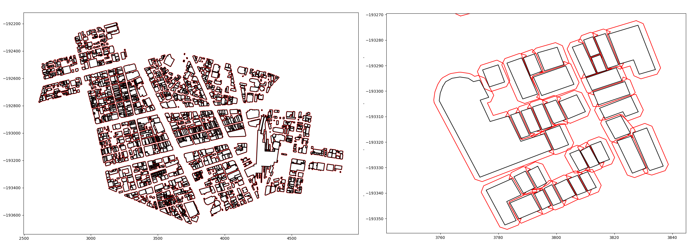
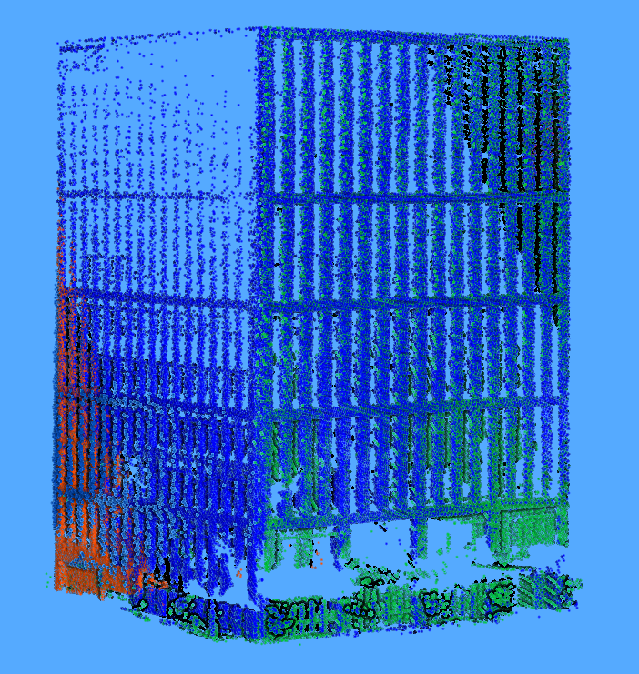
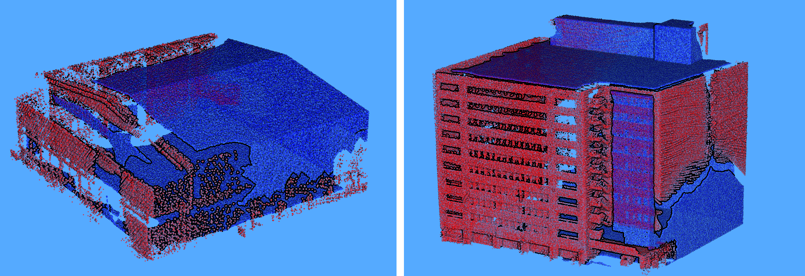
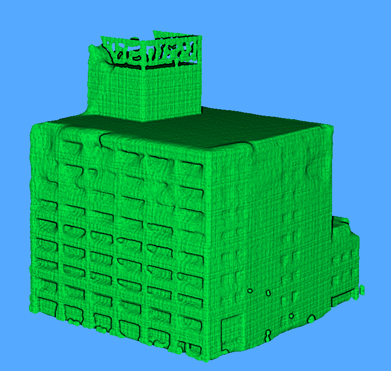

# 「AIを用いた3D都市モデルの自動更新手法」の成果物（１）

## 1. 概要
公共交通のバスやタクシー等のモビリティに搭載されたLiDAR等で定常的に取得される点群データや、スマートフォン等で市民が日常的に取得できるデータを活用して、3D都市モデルのデータソースを取得。これに基づき点群合成・更新箇所検出を行うA.I.モデルを及び3D都市モデルを生成する自動モデリングツールの使用方法を記載したものです。  

## 2. モジュール構成
今回、実証開発した自動モデリングシステムは、大きく3つのモジュールからなり、6つのステップで処理を行ないます。



| モジュール | 処理ステップ | 対応スクリプト |
|:----------|:------------|:------------|
| A. 入力データ処理モジュール   | (1) ノイズ除去<br>(2) 建物抽出<br><br>(3) 点群合成 | - <br>01_create_footprint_polygons.py<br>02_polygon_expansion.py<br>04_split_dataset_points_to_buildings_with_realignment.py |
| B. 変更箇所特定モジュール<br>（[別リポジトリ](https://github.com/Symmetry-Dimensions-Inc/Registration_Neural_Network)） | (4) 変更箇所特定 | pointcloud_similarity.py |
| C. 3Dメッシュ再構築モジュール | (5) メッシュ再構築<br><br>(6) 窓検出 | 05_combine_lod2_and_point_cloud.py<br>06_run_iPSR.py<br>05_combine_lod2_and_point_cloud.py |

本リポジトリは「A. 入力データ処理モジュール」と「C. 3Dメッシュ再構築モジュール」を含んでおり、「B. 変更箇所特定モジュール」は、[別リポジトリ](https://github.com/Symmetry-Dimensions-Inc/Registration_Neural_Network)にて公開しています。

また、「(1) ノイズ除去」については、オープンソース対象外の為、本リポジトリには含まれず、予めノイズ除去済みの点群データを用意することを前提としています。

## 3. 利用手順

### 動作環境
本プログラムは Windows 10 にインストールされた Python 3.8 で動作確認を行なっています。他のプラットフォームや Python のバージョンで動作させるには、ソースコードや設定ファイルの修正が必要になることがあります。

反復的なメッシュ生成に使用する iPSR アルゴリズム (https://github.com/houfei0801/ipsr) の Windows 実行可能ファイルを含みますが、Windows 以外のプラットフォームで利用する際には、ソースコードから再コンパイルする必要があります。

### 前提ライブラリのインストール
以下のコマンドを実行し、Python の前提ライブラリをインストールします。
```sh
pip install -r requirements.txt
```

### データの準備
既にノイズ除去されており、建物データのみにフィルタリングされた LAS Version 1.4 形式の点群データを準備します。

本リポジトリは、ノイズ除去済みのサンプルデータを含んでいます。
`Data/Test_segmented_data/` フォルダにある zip ファイルを解凍してください。

### (2) 建物抽出

#### (2a) 2Dフットプリントの作成
`Script/01_create_footprint_polygons.py` スクリプト内の各パラメータを設定します。
| パラメータ    | 説明                         |
|:-------------|:-----------------------------|
| input_path   | Wavefrontの.obj形式のターゲット建物LOD2モデルを含むディレクトリ |
| output_path  | 結果のテキストファイルの出力先 |
| dilation_amount | ポリゴンは作成時に直接拡張可能だが近傍建物は考慮されない。0.0に設定しておき、フットプリントのポリゴンサイズを大きくするには別のスクリプトを使用 |
| visualize_results | ポリゴン画像の出力時 True、それ以外は False に設定 |

スクリプトを実行し、各 LOD2 建物モデルの 0-dilation 2D フットプリントポリゴンを作成します。
```sh
python Scripts/01_create_footprint_polygons.py
```



#### (2b) 2Dフットプリントの拡張
`Script/02_polygon_expansion.py` スクリプト内の各パラメータを設定します。
| パラメータ    | 説明                         |
|:-------------|:-----------------------------|
| process_all_buildings | True に設定すると input_filename で定義されたすべてのビルを処理<br> target_building で定義された単一の建物のみを処理する場合は False に設定 |
| target_building |  input_filename に含まれる1棟の建物のLOD2モデル名 |
| input_filename | `01_create_footprint_polygons.py`スクリプトで生成される、建物フットプリント定義を含むファイル |
| output_filename | 拡張された2Dフットプリントポリゴンの定義を含む結果のテキストファイル |
| dilation_amount | 2Dフットプリントポリゴンを拡張する量（メートル単位） |
| visualize_results | 2Dフットプリントポリゴン画像の出力時 True、それ以外は False に設定 |
| output_results_to_file | 2Dフットプリントポリゴンのファイル出力時 True 、それ以外は False に設定 |

前のステップで作成した 0-dilation フットプリントポリゴンを拡張するためにスクリプトを実行します。
```sh
python Scripts/02_polygon_expansion.py
```


### (3) 点群合成

上記で作成した拡張された建物フットプリントデータを使用して、実際の LiDAR データをポイントクラウドデータセットから切り出し、次のスクリプトを使用してオーバーレイおよびアラインメントさせます。

`Script/04_split_dataset_into_buildings_with_realignment.py` スクリプト内の各パラメータを設定します。
| パラメータ    | 説明                         |
|:-------------|:-----------------------------|
| input_building_list | ターゲットビルディングのLOD2 .obj名リスト |
| building_polygons_file | 拡張された建物のフットプリントポリゴンの定義（LOD2 .obj名でID付与）を持つテキストファイル |
| bounds_file | LiDARデータセットの各点群のバウンディングボックスを生成して処理を高速化<br>（`create_dataset_bounding_box_list.py` で生成） |
| input_dataset_path | セグメント化されたLiDARデータセットの位置 LASデータ |
| aligned_output_path | アラインメントとされた結合建物点群の出力へのパス |
| unaligned_output_path | 点群合成されていない結合建物点群を出力するためのパス |

スクリプトを実行し、拡張されたフットプリントポリゴンによって、建物の周りの余分な要素を除去します。
```sh
python Scripts/04_split_dataset_into_buildings_with_realignment.py
```


### (5) メッシュ再構築、(6) 窓検出 

#### (5a) 点群データのLOD2補間
LiDARでスキャンした点群データは建物全体をカバーしていないため、LOD2 データを使用して建物の形状を使用して点群の隙間を補間します。

`Script/05_combined_LOD2_and_point_cloud.py` スクリプト内の各パラメータを設定します。
| パラメータ    | 説明                         |
|:-------------|:-----------------------------|
| input_point_cloud_path | `04_split_dataset_points_to_buildings_with_realignment.py` で出力されるLAS形式の点群の格納ディレクトリ |
| input_lod2_obj_path | Wavefrontの.OBJ形式のLOD2建物モデルの格納ディレクトリ |
| output_point_cloud_path | 生成された点群の格納ディレクトリ |
| process_entire_directory | True 設定時、入力パスの全点群を処理（点群に一致するLOD2モデルが必要）<br>それ例外は、 building_number で定義された1つの建物だけを処理 |
| building_number | process_entire_directory を False に設定時、この番号を持つ建物のみを処理 |
| use_preprocessed_data | True の場合、LiDAR/LOD2 データの計算をスキップし、メッシュ生成とウィンドウ検出を続行 |
| create_meshes | 標準ポアソン表面再構成法によるメッシュ生成を行なう<br>(窓検出の目的でのみ利用)|
| filter_low_density_from_mesh | True の場合、メッシュ出力前に点密度の低い領域を削除 |
| skip_lod2_on_mesh_creation | LOD2データを無視した場合に、メッシュ生成にどのような悪影響があるかをテスト |
| perform_window_detection | 窓の検出を行なう<br>created_meshes は True に設定する必要がある |
| output_mesh_path | 生成されたメッシュデータの出力パス |

スクリプトを実行します。
```sh
python Scripts/05_combined_LOD2_and_point_cloud.py
```


#### (5b) iPSRによるメッシュ再構築
`Script/04_split_dataset_into_buildings_with_realignment.py` スクリプト内の各パラメータを設定します。
| パラメータ    | 説明                         |
|:-------------|:-----------------------------|
| process_entire_folder |  True 設定時、入力フォルダ内の全点群を処理する<br>False 設定時、1つの点群を定義する |
| input_path | LAS形式で保存された点群（要点群合成処理）を含むフォルダ |
| output_path | 最終メッシュの出力先となるフォルダ |
| input_filename | process_entire_folder を False に設定した時の入力点群ファイル名 |
| output_filename | process_entire_folder を False に設定した時の出力点群ファイル名 |

スクリプトを実行して、上記ステップで結合された点群データのメッシュを生成します。
```sh
python Scripts/06_run_iPSR.py
```


## ライセンス
* 本ドキュメントは[Project PLATEAUのサイトポリシー](https://www.mlit.go.jp/plateau/site-policy/)（CCBY4.0および政府標準利用規約2.0）に従い提供されています。

## 注意事項
* 本レポジトリは参考資料として提供しているものです。動作保証は行っておりません。
* 予告なく変更・削除する可能性があります。
* 本レポジトリの利用により生じた損失及び損害等について、国土交通省はいかなる責任も負わないものとします。

## 参考資料
* 技術検証レポート: https://www.mlit.go.jp/plateau/file/libraries/doc/plateau_tech_doc_0053_ver01.pdf
